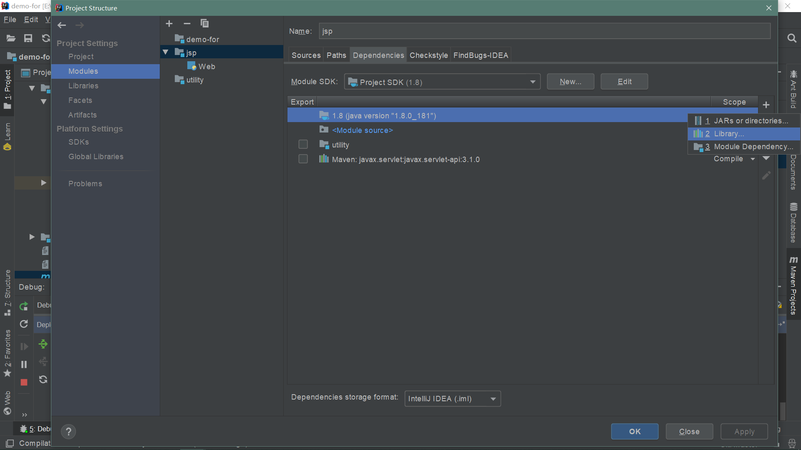

# demo-for-jsp-web

#### idea创建普通的基于servlet或jsp的JavaWeb项目:
* file->new->project->java Enterprise->web Application->next...
* 此时应自动配置好tomcat, 可以直接运行
* 如果没有自动跳出页面需要手动打开
* 如果是创建maven项目然后添加webFramework参考父项目readme
* 非maven项目添加依赖
*  `本地依赖: 全局lib` 
*  `本地依赖: 全局lib` 
*  `本地依赖: 全局lib` 

#### idea创建maven项目:
* 参见参考父项目readme
* maven项目添加依赖, 注意:
1. `A`左侧jsp-1.0-SNAPSHOT下lib目录
2. `B`左下角External libraries
3. `C`中间添加的maven依赖
4. `D`右边maven模块的依赖项
*  `maven依赖` 

#### Tips
1. 在maven项目中添加本地依赖是无效的: 上述本地依赖添加后, 仍然无法正确运行;
`本地依赖在maven reimport后会失效(前面的勾会被取消, 全局包的勾不会被取消 但貌似也是无效的)`

2. 依赖是否添加成功以`A`最终的实际部署target目录为准
3. maven依赖是否添加成功也可以通过`D`判断
4. 至于`B`, 暂时不清楚其具体意义
5. alt+enter可以自动判断或是解决一部分依赖: 将其加入pom.xml中; 比如 servlet类 
