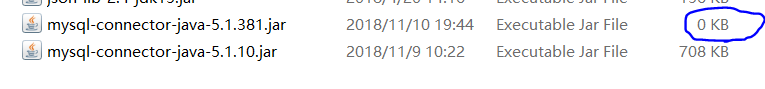

# demo-for-jsp-web

#### idea创建普通的基于servlet或jsp的JavaWeb项目:
* file->new->project->java Enterprise->web Application->next...
* 此时应自动配置好tomcat, 可以直接运行
* 如果没有自动跳出页面需要手动打开
* 如果是创建maven项目然后添加webFramework参考父项目readme
* 非maven项目添加依赖
*  `本地依赖: 全局lib` 
*  `本地依赖: 全局lib` 
*  `本地依赖: 全局lib` 

#### idea创建maven项目:
* 参见参考父项目readme
* maven项目添加依赖, 注意:
1. `A`左侧jsp-1.0-SNAPSHOT下lib目录
2. `B`左下角External libraries
3. `C`中间添加的maven依赖
4. `D`右边maven模块的依赖项
*  `maven依赖` 

#### Tips
1. 在maven项目中添加本地依赖是无效的: 上述本地依赖添加后, 仍然无法正确运行;
`本地依赖在maven reimport后会失效(前面的勾会被取消, 全局包的勾不会被取消 但貌似也是无效的)`

2. 依赖是否添加成功以`A`最终的实际部署target目录为准
3. maven依赖是否添加成功也可以通过`D`判断
4. 在`B`中delete对应的包后 外部对应的包实体将被删除, module依赖面板中对应包的颜色变红 另外即使此处包涵需要的包, 在maven下以无效
5. alt+enter可以自动判断或是解决一部分依赖: 将其加入pom.xml中; 比如 servlet类 
* 使用MySQL时在添加了驱动包的情况下, 使用jdbc的页面仍然Class Not Found
1. 驱动包错误现象:
`添加单个jar包的前提下, jar包无法展开;` 

`添加时idea无法识别;` 
`直接查看该文件, 大小不对劲;` 
`正常重添加artifact后异常关键信息类似` Caused by: LifecycleException: Failed to start component.. @see https://stackoverflow.com/questions/18404916/failed-to-start-component-standardenginecatalina-standardhostlocalhost-stan

* 在非maven项目中添加本地依赖后需要重新生成 artifact
1. artifact(字面义: n. 人工制品；手工艺品) @see: https://stackoverflow.com/questions/2487485/what-is-a-maven-artifact
`貌似这么做是无效的 仍然需要重新添加` 

# PS
1. 现在需要手动配置res目录才能访问jdbc.properties中的配置
2. servlet测试: http://localhost:8080/hello 返回HelloWorld
3. 如果添加的依赖包是一个目录的话 目录更改那么所有使用该目录的artifact貌似都得重新生成
4. 虽然应该是常识, 但本地依赖并不能上传到远程仓库, 故, 对于一个使用本地依赖的项目几乎只能自己使用
5. 在连同.idea一起上传远程仓库的情况下: 原本自动配置的项目在clone下来后不会自动配置Tomcat 本地依赖依然有效(依赖目录以及文件都未改变的情况下)
